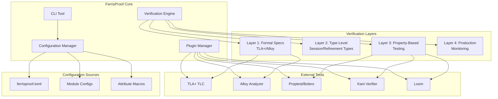
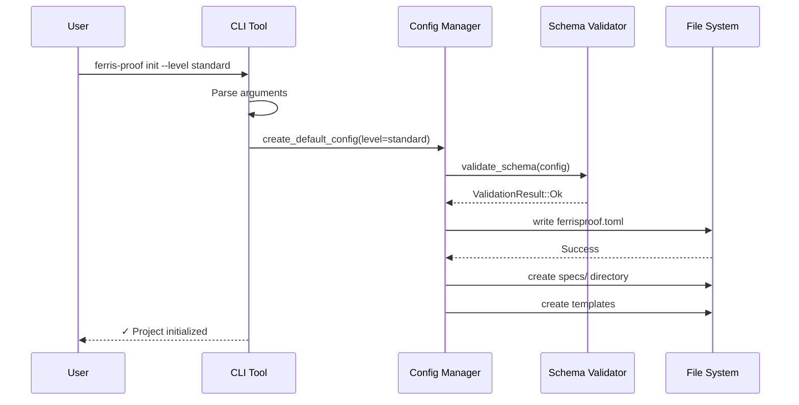
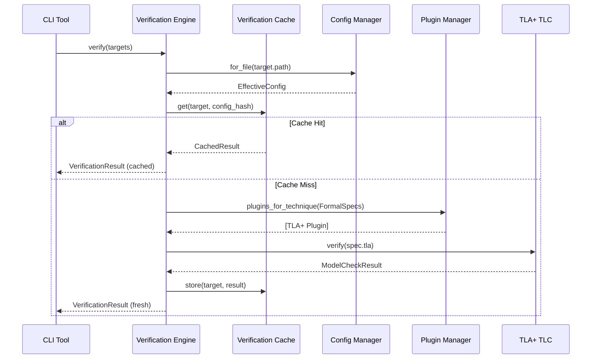

# FerrisProof

> *Rust. Verified. Proven.*

FerrisProof is a **full-stack correctness pipeline** for Rust applications, combining **formal modeling (TLA+, Alloy)**, **Rust's type system**, and **property-based testing** to ensure your systems are **memory-safe, structurally sound, and functionally correct**.

---

## Features

* **Multi-Layer Verification Architecture**: Four progressive verification layers with configurable enforcement
* **Formal Behavioral Modeling**: TLA+ for temporal properties, safety, and concurrency correctness
* **Structural Invariants**: Alloy models define and validate data constraints
* **Type-Level Verification**: Session types and refinement types for compile-time guarantees  
* **Property-Based Testing**: `proptest` ensures correctness across a wide range of inputs
* **Hierarchical Configuration**: Granular control with module-level and item-level overrides
* **Runtime Monitoring**: Optional assertions and logging to enforce invariants during execution
* **Traceability**: From formal models → Rust implementation → tests → runtime logs
* **CI/CD Integration**: Comprehensive reporting and build integration
* **Progressive Adoption**: Gradual verification level upgrades with migration assistance

---

## Verification Levels

FerrisProof supports four configurable verification levels:

| Level | Techniques | Use Case |
|-------|------------|----------|
| **Minimal** | Type safety only | Getting started, legacy code |
| **Standard** | + Property-based testing | Most production applications |
| **Strict** | + Session types, refinement types, concurrency testing | Mission-critical systems |
| **Formal** | + Formal specifications (TLA+/Alloy) | Distributed systems, protocols |

---

## Architecture Overview

### Multi-Layer Verification Architecture



### Configuration Hierarchy

```mermaid
graph TD
    ROOT[Root Config<br/>ferrisproof.toml]
    
    subgraph "Module Overrides"
        CRYPTO[crypto/*<br/>level: formal]
        API[api/*<br/>level: standard]
        UTILS[utils/*<br/>level: minimal]
    end
    
    subgraph "Item Attributes"
        FUNC[#[verification(level="strict")]<br/>Function Level]
        MOD[#[verification(spec="raft.tla")]<br/>Module Level]
    end
    
    ROOT --> CRYPTO
    ROOT --> API
    ROOT --> UTILS
    
    CRYPTO --> FUNC
    API --> MOD
```

---

## ?? Project Structure

```
ferris-proof/
├── Cargo.toml                    # Rust package file
├── src/                         # Rust implementation
├── models/                      # TLA+ & Alloy formal models
├── tests/                       # Property-based and integration tests
├── scripts/                     # Automation scripts
├── ferrisproof.toml            # Root configuration
└── ReadMe.md
```

---

## Setup & Installation

1. **Clone the repository**:

```bash
git clone https://github.com/yourusername/ferris-proof.git
cd ferris-proof
```

2. **Install Rust** (if not installed):
   [https://www.rust-lang.org/tools/install](https://www.rust-lang.org/tools/install)

3. **Install TLA+ tools**:
   Download [TLA+ Toolbox](https://lamport.azurewebsites.net/tla/tools.html)

4. **Install Alloy Analyzer**:
   [http://alloytools.org/](http://alloytools.org/)

5. **Install dependencies and run tests**:

```bash
cargo build
cargo test
```

6. **Initialize project with verification configuration**:

```bash
cargo run -- init --level standard
```

7. **Run verification checks**:

```bash
cargo run -- check
```

8. **Run property-based tests**:

```bash
cargo test --test property_tests
```

9. **Run integration tests**:

```bash
cargo test --test integration_tests
```

---

## ⚙️ Configuration

FerrisProof uses hierarchical TOML configuration with the following precedence (highest to lowest):

1. **Item-level attributes** (`#[verification(...)]`)
2. **Module-level glob patterns** (most specific path match)
3. **Module configuration files** (nearest ancestor directory)
4. **Root configuration** (`ferrisproof.toml`)

### Example Configuration

```toml
# ferrisproof.toml
[profile]
level = "standard"
enforcement = "error"

[tools]
tlaplus = { version = "^1.8", timeout = "300s" }
alloy = { version = "^6.0", memory = "4G" }

[modules]
"consensus::*" = { level = "formal" }
"api::public::*" = { level = "strict" }
"utils::*" = { level = "minimal" }

[features]
property_tests = true
session_types = true
refinement_types = false
```

---

## Verification Reports

FerrisProof generates comprehensive verification reports in multiple formats:

- **JSON**: Machine-readable for CI integration
- **Markdown**: Human-readable with rich formatting
- **HTML**: Interactive web-based reports

Report contents include:
- Verification status per layer
- Violations with severity levels
- Performance metrics and timing
- Cache hit rates and efficiency
- Tool versions and configurations

---

## Security & Privacy

FerrisProof is designed with security in mind:

- **No external data transmission** without explicit consent
- **Local-only verification** for sensitive codebases
- **Sandboxed execution** of external tools
- **Input validation** to prevent path traversal
- **Secure configuration parsing**

---

## Performance Targets

| Verification Level | Project Size | Target Duration | Memory Usage |
|--------------------|--------------|-----------------|--------------|
| Minimal            | <100k LOC    | <30s           | <500 MB      |
| Standard           | <100k LOC    | <5 min         | <2 GB        |
| Strict             | <50k LOC     | <10 min        | <4 GB        |
| Formal             | <10k LOC     | <30 min        | <8 GB        |

---

## ?? Error Handling

FerrisProof provides structured error handling with:

- **Standardized error codes** (FP-XXX-XXX format)
- **Detailed explanations** and suggested fixes
- **Color-coded severity levels**
- **Machine-readable error output**
- **Comprehensive error catalog**

### Common Error Codes

| Code | Description | Suggested Fix |
|------|-------------|---------------|
| FP-CF-001 | Invalid verification level | Use: minimal, standard, strict, formal |
| FP-CF-002 | Missing required configuration field | Run `ferris-proof init` |
| FP-VR-001 | Property test failure | Review counterexample |
| FP-TL-001 | TLA+ TLC not found | Install TLA+ tools |

---

## 🔄 Workflow Examples

### Project Initialization



### Verification with Caching



---

## Future Directions

* Auto-generate Rust property tests from Alloy/TLA+ models
* Extend support for distributed multi-agent systems
* Continuous verification in CI/CD pipelines
* Runtime trace comparison with TLA+ execution paths
* Advanced caching and incremental verification
* Plugin ecosystem for additional verification backends

---

## Acknowledgments

- **TLA+ Community** for formal methods inspiration
- **Rust Community** for excellent type system and tooling
- **Property-based Testing** pioneers for universal verification approach

---