# FerrisProof

> **Rust. Verified. Proven.**: *Making Rust systems provably correct, one layer at a time.* 

FerrisProof is a **full-stack correctness pipeline** for Rust applications, combining **formal modeling (TLA+, Alloy)**, **Rust's type system**, and **property-based testing** to ensure your systems are **memory-safe, structurally sound, and functionally correct**.

[](https://codecov.io/gh/yumin-chen/ferris-proof)
[](http://creativecommons.org/publicdomain/zero/1.0/)

> **🚧 Active Development**: FerrisProof is currently in active development. Core infrastructure and CLI tools are complete, with verification layers being progressively implemented.

Multi-layer correctness pipeline for Rust applications that combines formal modeling, type-level verification, and property-based testing to ensure systems are memory-safe, structurally sound, and functionally correct.

---

## Quick Start

### Installation

```bash
# Clone the repository
git clone https://github.com/yumin-chen/ferris-proof.git
cd ferris-proof

# Build and install the CLI tool
cargo install --path ferris-proof-cli
```

### Initialise a New Project

```bash
# Initialise with standard verification level
ferris-proof init --level standard

# Interactive initialization with prompts
ferris-proof init --interactive

# Initialise with formal verification level
ferris-proof init --level formal
```

### Basic Commands

```bash
# Show project configuration
ferris-proof config

# Validate configuration
ferris-proof config --validate

# Show configuration for specific file
ferris-proof config --file src/main.rs

# Explain error codes
ferris-proof explain FP-CF-001

# Get help
ferris-proof --help
ferris-proof init --help
```

---

## Features

- **🚀 Command-Line Interface**: Full-featured CLI with project initialization, configuration management, and error explanation
- **📊 Multi-Layer Verification**: Four progressive verification layers targeting different classes of errors
- **📝 Formal Specifications**: TLA+ and Alloy integration for protocol-level correctness
- **🔒 Type-Level Verification**: Session types and refinement types for compile-time guarantees
- **🧪 Property-Based Testing**: Comprehensive property testing with proptest integration
- **📈 Production Monitoring**: Runtime assertions and observability hooks
- **⬆️ Progressive Adoption**: Gradual verification level upgrades with automated scaffolding
- **🔄 CI/CD Integration**: GitHub Actions support with configurable enforcement modes
- **⚙️ Hierarchical Configuration**: Module-level and item-level verification overrides
- **💾 Comprehensive Caching**: Content-addressed verification result caching
- **🔐 Security-First**: Sandboxed execution and local-only verification options

---

## Architecture Overview

### Multi-Layer Verification Architecture


### **Highlights**

1. **Rust-Centric Type Guarantees**

   * Typestate & linear types enforce layer dependencies at compile-time.
   * Refinement types validate value-level invariants.
   * AST validation ensures attribute macros and configuration correctness.

2. **Layered DAG Enforcement**

   * Each layer only executes if prior layers pass successfully.
   * Ensures **formal → type → property → monitoring** sequence is never violated.

3. **Incremental Verification & Caching**

   * All layers are cache-aware; avoids redundant execution.
   * Cache keyed by **AST content, configuration hash, and tool versions**.

4. **Sandboxed Plugin Execution**

   * External tools run in isolated sandboxes with:

     * Restricted filesystem access
     * Network denied or allowlist
     * Resource limits (CPU, memory, file descriptors)
   * Captures outputs for structured parsing.

5. **Observability & Metrics**

   * Metrics collected for all layers: execution time, cache hits, violations.
   * Supports structured logs for CI and human-readable output.

6. **Unified Orchestration**

   * CLI → Config → Verification Engine → Plugin Manager → Layers → Cache/Metrics
   * Ensures reproducible, safe, and type-checked verification runs.

### Configuration Hierarchy


---

## Project Structure

```
ferris-proof/
├── ferris-proof-cli/             # Command-line interface
├── ferris-proof-core/            # Core verification engine
├── ferris-proof-config/          # Configuration management
├── ferris-proof-plugins/         # Plugin system and tool integrations
├── scripts/                      # CI/CD and development scripts
│   ├── ci-local.sh              # Local CI pipeline
│   ├── ci-setup.sh              # Development environment setup
│   └── container-build.sh       # Container build script
├── docs/                         # Documentation
│   ├── ferris-proof.tsd.specs.md # Detailed architecture design
│   ├── ferris-proof.prd.specs.md # Functional requirements
│   └── ci-pipeline.md           # CI/CD documentation
├── Cargo.toml                    # Workspace configuration
├── Containerfile                 # Standard container build
├── Containerfile.alpine          # Minimal Alpine container build
├── Makefile                      # Common development tasks
├── .gitlab-ci.yml               # GitLab CI/CD pipeline
├── .github/                      # GitHub Actions workflows
├── ReadMe.md                     # This file
├── Contributing.md               # Contribution guidelines
└── Licence.md                    # CC0 1.0 Universal licence
```

---

## Development Status

### ✅ Completed
- **Core Infrastructure**: Rust workspace with 4 crates
- **CLI Tool**: Complete command-line interface with project initialization, configuration management, and error explanation
- **Configuration System**: Hierarchical TOML configuration with validation and discovery
- **Plugin Architecture**: Extensible verification tool integration with sandboxed execution
- **Property-Based Testing**: Framework for correctness validation with comprehensive test coverage
- **Verification Cache**: Content-addressed caching system with invalidation logic
- **CI/CD Pipeline**: GitHub Actions with multi-platform testing and property-based test integration
- **Documentation**: Comprehensive specs, API docs, and getting-started guides
- **Security**: Sandboxed execution, input validation, and local-only verification

### 🚧 In Progress
- **Verification Engine**: Core orchestration logic for multi-layer verification
- **Formal Specification Integration**: TLA+ and Alloy tool integration
- **Type-Level Verification**: Session types and refinement types implementation

### 📋 Planned
- **Production Monitoring**: Runtime assertions and observability hooks
- **Advanced Tool Integrations**: Kani, Loom, and additional verification backends
- **Performance Optimizations**: Parallel verification and advanced caching strategies

## Setup & Installation

### Prerequisites

- **Rust 1.70+** (latest stable recommended)
- **Git** for version control

### Optional Tools (for full verification)

- **TLA+ Toolbox**: [Download here](https://lamport.azurewebsites.net/tla/tools.html)
- **Alloy Analyzer**: [Download here](http://alloytools.org/)

### Build from Source

```bash
# Clone the repository
git clone https://github.com/yumin-chen/ferris-proof.git
cd ferris-proof

# Build all crates
cargo build --all-features

# Run tests (including property-based tests)
cargo test --all-features

# Install CLI tool
cargo install --path ferris-proof-cli

# Verify installation
ferris-proof --version
```

### Using the CLI Tool

```bash
# Initialise a new project
ferris-proof init --level standard

# Show project configuration
ferris-proof config

# Validate configuration
ferris-proof config --validate

# Explain error codes
ferris-proof explain FP-CF-001

# Get help for any command
ferris-proof --help
ferris-proof init --help
```

---

## Configuration

FerrisProof uses hierarchical TOML configuration. Initialise a project to get started:

```bash
# Initialise with interactive prompts
ferris-proof init --interactive

# Or initialise with a specific level
ferris-proof init --level standard
```

This creates a `ferrisproof.toml` file in your project root:

```toml
[profile]
level = "standard"
enforcement = "warning"
enabled_techniques = ["TypeSafety", "PropertyTests"]

[tools.proptest]
cases = 1000
max_shrink_iters = 10000

[features]
cache_enabled = true
parallel_execution = true
generate_reports = true

[thresholds]
max_verification_time = 300  # 5 minutes
max_memory_usage = 2147483648  # 2GB
cache_ttl = 86400  # 24 hours
```

### Verification Levels

- **Minimal**: Type safety only
- **Standard**: Type safety + Property-based testing
- **Strict**: + Session types, refinement types, concurrency testing
- **Formal**: + Formal specifications (TLA+, Alloy)

### Configuration Commands

```bash
# Show current configuration
ferris-proof config

# Validate configuration
ferris-proof config --validate

# Show effective configuration for a specific file
ferris-proof config --file src/main.rs
```

### Configuration Hierarchy

FerrisProof uses hierarchical TOML configuration with the following precedence (highest to lowest):

1. **Item-level attributes** (`#[verification(...)]`)
2. **Module-level glob patterns** (most specific path match)
3. **Module configuration files** (nearest ancestor directory)
4. **Root configuration** (`ferrisproof.toml`)

---

## Verification Reports

FerrisProof generates comprehensive verification reports in multiple formats:

- **JSON**: Machine-readable for CI integration
- **Markdown**: Human-readable with rich formatting
- **HTML**: Interactive web-based reports

Report contents include:
- Verification status per layer
- Violations with severity levels
- Performance metrics and timing
- Cache hit rates and efficiency
- Tool versions and configurations

---

## Security & Privacy

FerrisProof is designed with security in mind:

- **No external data transmission** without explicit consent
- **Local-only verification** for sensitive codebases
- **Sandboxed execution** of external tools
- **Input validation** to prevent path traversal
- **Secure configuration parsing**

---

## Performance Targets

| Verification Level | Project Size | Target Duration | Memory Usage |
|--------------------|--------------|-----------------|--------------|
| Minimal            | <100k LOC    | <30s           | <500 MB      |
| Standard           | <100k LOC    | <5 min         | <2 GB        |
| Strict             | <50k LOC     | <10 min        | <4 GB        |
| Formal             | <10k LOC     | <30 min        | <8 GB        |

---

## Error Handling

FerrisProof provides comprehensive error handling with detailed explanations:

```bash
# Explain any error code
ferris-proof explain FP-CF-001
ferris-proof explain FP-VR-001
ferris-proof explain FP-TL-001
```

### Error Code Categories

- **FP-CF-XXX**: Configuration errors
- **FP-VR-XXX**: Verification errors  
- **FP-TL-XXX**: Tool errors
- **FP-IO-XXX**: I/O and file system errors

### Common Error Codes

| Code | Description | Suggested Fix |
|------|-------------|---------------|
| FP-CF-001 | Invalid verification level | Use: minimal, standard, strict, formal |
| FP-CF-002 | Missing required configuration field | Run `ferris-proof init` |
| FP-VR-001 | Property test failure | Review counterexample |
| FP-TL-001 | TLA+ TLC not found | Install TLA+ tools |

Each error explanation includes:
- Detailed description
- Common causes
- Step-by-step solutions
- Code examples
- Related error codes

---

## CLI Reference

### Global Options

```bash
ferris-proof [OPTIONS] <COMMAND>

Options:
  --config <FILE>              Path to configuration file
  -v, --verbose...             Enable verbose output (can be repeated)
  --output-format <FORMAT>     Output format: human, json, compact
  --no-color                   Disable colored output
  -h, --help                   Print help
  -V, --version                Print version
```

### Commands

#### `init` - Initialise Project
```bash
ferris-proof init [OPTIONS]

Options:
  --level <LEVEL>              Verification level [default: standard]
  --interactive                Use interactive mode
  --template <TEMPLATE>        Project template to use
```

#### `config` - Show Configuration
```bash
ferris-proof config [OPTIONS]

Options:
  --file <FILE>                Show config for specific file
  --validate                   Validate configuration
```

#### `explain` - Explain Error Codes
```bash
ferris-proof explain <ERROR_CODE>

Arguments:
  <ERROR_CODE>                 Error code to explain (e.g., FP-CF-001)
```

---

## Workflow Examples

### Project Initialization

```mermaid
sequenceDiagram
    participant U as User
    participant CLI as CLI Tool
    participant CM as Config Manager
    participant FS as File System

    U->>CLI: ferris-proof init --level standard
    CLI->>CLI: Parse arguments and validate level
    CLI->>CM: create_config_for_level(standard)
    CM->>FS: write ferrisproof.toml
    FS-->>CM: Success
    CLI->>FS: create directory structure
    CLI->>FS: create template files (if specified)
    CLI-->>U: ✓ Project initialised successfully
```



### Configuration Management

```mermaid
sequenceDiagram
    participant U as User
    participant CLI as CLI Tool
    participant CM as Config Manager
    participant V as Validator

    U->>CLI: ferris-proof config --validate
    CLI->>CM: load_project_config()
    CM->>CM: discover_config_files()
    CM->>CM: merge_hierarchical_configs()
    CM->>V: validate_config()
    alt Valid Configuration
        V-->>CM: ValidationResult::Ok
        CM-->>CLI: Configuration valid
        CLI-->>U: ✓ Configuration is valid
    else Invalid Configuration
        V-->>CM: ValidationResult::Error(details)
        CM-->>CLI: Validation errors
        CLI-->>U: ✗ Configuration validation failed
    end
```



### Error Code Explanation


### Verification with Caching


---
## Documentation

- [Getting Started Guide](docs/getting-started.md)
- [CLI Reference](#cli-reference) - Complete command-line interface documentation
- [Configuration Guide](#configuration) - Hierarchical configuration system
- [Error Handling](#error-handling) - Comprehensive error code catalog
- [CI Pipeline](docs/ci-pipeline.md)
- [API Documentation](https://docs.rs/ferris-proof)

For detailed technical information:

- **[Design Document](docs/ferris-proof.tsd.specs.md)** - Comprehensive architecture and implementation details
- **[Requirements Document](docs/ferris-proof.prd.specs.md)** - Functional requirements and acceptance criteria
- **[Task Tracking](.kiro/specs/ferris-proof/tasks.md)** - Implementation progress and task status

---

## Future Directions

* Auto-generate Rust property tests from Alloy/TLA+ models
* Extend support for distributed multi-agent systems
* Continuous verification in CI/CD pipelines
* Runtime trace comparison with TLA+ execution paths
* Advanced caching and incremental verification
* Plugin ecosystem for additional verification backends

---

## Contributing

We welcome contributions! Please see [Contributing.md](Contributing.md) for guidelines.

## Licence

This work is dedicated to the public domain under the [CC0 1.0 Universal](Licence.md) licence.

To the extent possible under law, the contributors have waived all copyright and related or neighbouring rights to this work.
