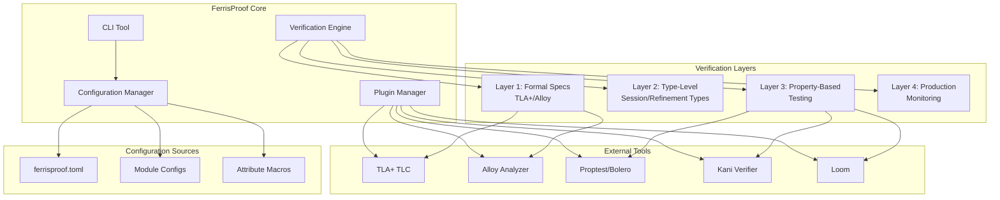
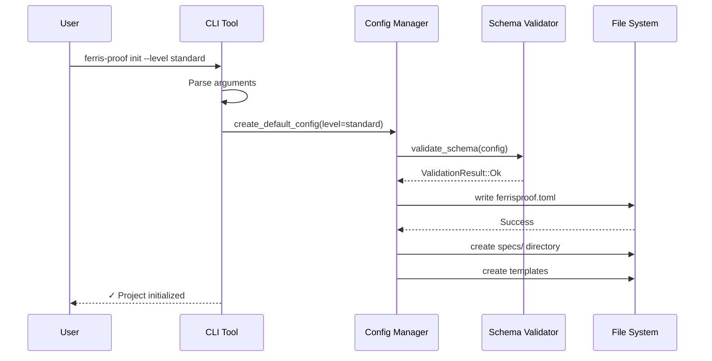
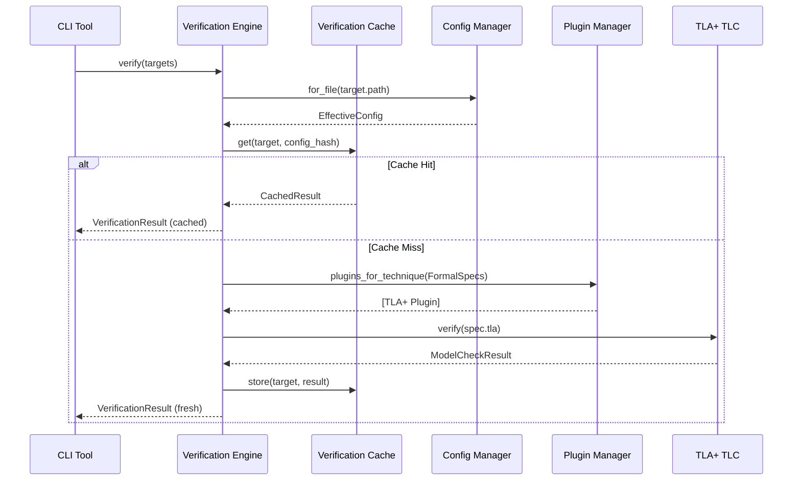
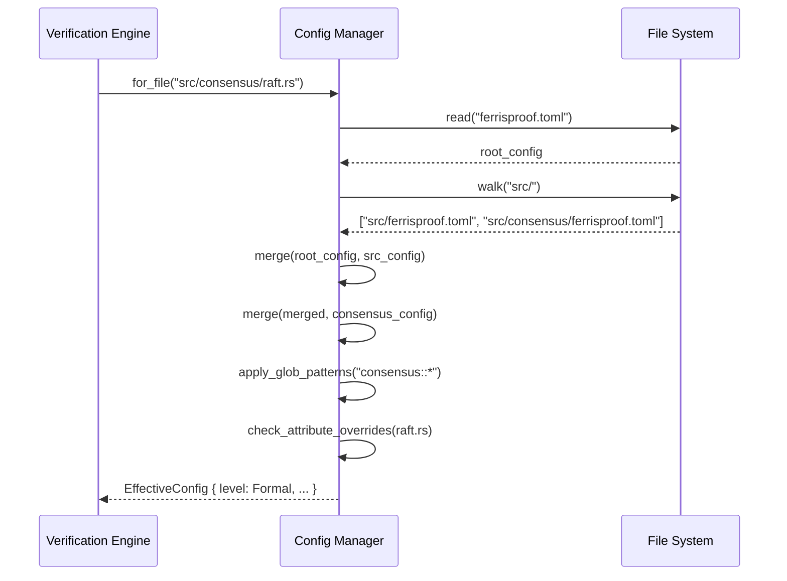

# FerrisProof: Multi-Layer Correctness Pipeline

## Overview

FerrisProof is a comprehensive correctness pipeline for Rust applications that combines formal modeling, type-level verification, and property-based testing. The system operates through four progressive verification layers, each targeting different classes of errors with configurable enforcement levels and gradual adoption paths.

The architecture follows a layered approach where each layer builds upon the previous one:
- **Layer 1**: Formal Specification (TLA+/Alloy) for protocol-level correctness
- **Layer 2**: Type-Level Verification (session types, refinement types) for compile-time guarantees  
- **Layer 3**: Property-Based Testing for runtime invariant verification
- **Layer 4**: Production Monitoring for observability and runtime assertions

## Architecture

### System Architecture Overview



### Configuration Hierarchy

```mermaid
graph TD
    ROOT[Root Config<br/>ferrisproof.toml]
    
    subgraph "Module Overrides"
        CRYPTO[crypto/*<br/>level: formal]
        API[api/*<br/>level: standard]
        UTILS[utils/*<br/>level: minimal]
    end
    
    subgraph "Item Attributes"
        FUNC[#[verification(level="strict")]<br/>Function Level]
        MOD[#[verification(spec="raft.tla")]<br/>Module Level]
    end
    
    ROOT --> CRYPTO
    ROOT --> API
    ROOT --> UTILS
    
    CRYPTO --> FUNC
    API --> MOD
```

## Interaction Patterns and Workflows

### Workflow 1: Project Initialization



### Workflow 2: Verification Execution with Caching



### Workflow 3: Configuration Discovery and Merging



### Diagram Notation
- **Solid arrows (→)**: Direct function calls or synchronous communication
- **Dashed arrows (-->)**: Return values or responses
- **Thick arrows (==>)**: Data flow or configuration propagation
- **Subgraphs**: Logical component groupings or deployment boundaries
- **Colors**:
  - Blue: Core FerrisProof components
  - Green: External verification tools
  - Yellow: Configuration sources
  - Gray: File system or external resources

## Configuration Resolution Algorithm

### Precedence Rules

Configuration resolution follows a **hierarchical merge strategy** with the following precedence (highest to lowest):

1. **Item-level attributes** (`#[verification(...)]`)
2. **Module-level glob patterns** (most specific path match)
3. **Module configuration files** (nearest ancestor directory)
4. **Root configuration** (`ferrisproof.toml` at project root)

### Merging Algorithm

```rust
impl ConfigManager {
    /// Resolve effective configuration for a file
    fn resolve_config(&self, file_path: &Path) -> EffectiveConfig {
        let mut config = self.root_config.clone();
        
        // 1. Apply ancestor module configs (bottom-up)
        for ancestor_config in self.find_ancestor_configs(file_path) {
            config = self.merge(config, ancestor_config);
        }
        
        // 2. Apply glob pattern matches (most specific first)
        let module_path = self.file_to_module_path(file_path);
        let matching_patterns = self.find_matching_patterns(&module_path);
        
        // Sort by specificity (longest path = most specific)
        let sorted_patterns = matching_patterns
            .sort_by_key(|p| p.path_components().len())
            .rev();
        
        for pattern_config in sorted_patterns {
            config = self.merge(config, pattern_config);
        }
        
        // 3. Apply item-level attributes (parsed from AST)
        if let Some(attr_config) = self.parse_item_attributes(file_path) {
            config = self.merge(config, attr_config);
        }
        
        config.into()
    }
    
    /// Merge two configurations (override takes precedence)
    fn merge(&self, base: Config, override_config: Config) -> Config {
        Config {
            level: override_config.level.or(base.level),
            enforcement: override_config.enforcement.or(base.enforcement),
            enabled_techniques: self.merge_techniques(
                base.enabled_techniques, 
                override_config.enabled_techniques
            ),
            tool_config: self.merge_tool_config(
                base.tool_config, 
                override_config.tool_config
            ),
            // ... other fields
        }
    }
}
```

### Glob Pattern Specificity

Specificity is determined by:
- **Path depth**: `consensus::raft::*` > `consensus::*`
- **Wildcard type**: Exact match > single wildcard (*) > double wildcard (**)
- **Declaration order**: Later declarations win for equal specificity

## Verification Cache Design

### Cache Key Generation

```rust
#[derive(Debug, Clone, Hash, Eq, PartialEq)]
pub struct CacheKey {
    /// Content hash of verification target
    content_hash: ContentHash,
    
    /// Hash of effective configuration
    config_hash: ConfigHash,
    
    /// Version of FerrisProof and external tools
    tool_versions: ToolVersions,
    
    /// Verification layer
    layer: Layer,
}

impl CacheKey {
    fn compute_content_hash(target: &Target) -> ContentHash {
        // For Rust files: hash AST (ignore whitespace/comments)
        // For formal specs: hash normalized specification
        let mut hasher = Blake3::new();
        
        match target {
            Target::RustFile(path) => {
                let ast = syn::parse_file(&fs::read_to_string(path)?)?;
                let normalized = self.normalize_ast(&ast);
                hasher.update(&normalized);
            }
            Target::FormalSpec(path) => {
                let spec = fs::read_to_string(path)?;
                let normalized = self.normalize_spec(&spec);
                hasher.update(&normalized);
            }
        }
        
        ContentHash(hasher.finalize())
    }
}
```

### Cache Invalidation Strategy

Cache entries are invalidated when:
- **Content changes**: File modification detected via content hash mismatch
- **Configuration changes**: Effective config hash differs
- **Tool version changes**: External tool upgraded/downgraded
- **Dependency changes**: Transitive dependencies modified
- **Manual invalidation**: User runs `ferris-proof clean --cache`
- **Age threshold**: Entries older than 30 days (configurable)

## Components and Interfaces

### Configuration Manager

The Configuration Manager handles hierarchical configuration resolution and caching.

```rust
pub struct ConfigManager {
    root_config: Config,
    module_overrides: HashMap<PathBuf, Config>,
    cache: ConfigCache,
    schema_validator: SchemaValidator,
}

impl ConfigManager {
    /// Load configuration from project root with validation
    pub fn from_project_root(root: &Path) -> Result<Self, ConfigError>;
    
    /// Get effective configuration for a specific file
    pub fn for_file(&self, file_path: &Path) -> EffectiveConfig;
    
    /// Validate configuration against schema
    pub fn validate(&self) -> Result<(), Vec<ValidationError>>;
    
    /// Merge configurations with precedence rules
    fn merge_configs(&self, base: Config, overrides: &[Config]) -> Config;
}

#[derive(Debug, Clone)]
pub struct EffectiveConfig {
    pub level: VerificationLevel,
    pub enforcement: EnforcementMode,
    pub enabled_techniques: Vec<Technique>,
    pub tool_config: ToolConfig,
    pub thresholds: Thresholds,
}
```

### Verification Engine

The core engine orchestrates verification across all layers.

```rust
pub struct VerificationEngine {
    config_manager: ConfigManager,
    plugin_manager: PluginManager,
    cache: VerificationCache,
    metrics: MetricsCollector,
}

impl VerificationEngine {
    /// Run verification for specified targets
    pub async fn verify(&self, targets: &[Target]) -> VerificationResult;
    
    /// Run specific verification layer
    pub async fn verify_layer(&self, layer: Layer, target: &Target) -> LayerResult;
    
    /// Check if verification is required (cache validation)
    pub fn needs_verification(&self, target: &Target) -> bool;
    
    /// Generate verification artifacts
    pub fn generate_artifacts(&self, target: &Target) -> Result<Vec<Artifact>, Error>;
}

#[derive(Debug)]
pub struct VerificationResult {
    pub overall_status: Status,
    pub layer_results: HashMap<Layer, LayerResult>,
    pub metrics: VerificationMetrics,
    pub artifacts: Vec<Artifact>,
}
```

### Plugin Manager

Manages external tool integration with version compatibility checking.

```rust
pub struct PluginManager {
    plugins: HashMap<ToolName, Box<dyn VerificationPlugin>>,
    tool_registry: ToolRegistry,
    version_checker: VersionChecker,
}

pub trait VerificationPlugin: Send + Sync {
    fn name(&self) -> &str;
    fn supported_versions(&self) -> VersionRange;
    fn check_availability(&self) -> Result<ToolInfo, ToolError>;
    fn verify(&self, input: VerificationInput) -> Result<VerificationOutput, ToolError>;
    fn parse_output(&self, raw_output: &str) -> Result<StructuredResult, ParseError>;
}

impl PluginManager {
    /// Register a verification plugin
    pub fn register_plugin(&mut self, plugin: Box<dyn VerificationPlugin>);
    
    /// Get available plugins for a technique
    pub fn plugins_for_technique(&self, technique: Technique) -> Vec<&dyn VerificationPlugin>;
    
    /// Validate tool versions and availability
    pub fn validate_tools(&self) -> Result<(), Vec<ToolError>>;
}
```

### CLI Interface

Command-line interface with comprehensive subcommands and user experience features.

```rust
#[derive(Parser)]
#[command(name = "ferris-proof")]
pub struct Cli {
    #[command(subcommand)]
    pub command: Commands,
    
    #[arg(long, global = true)]
    pub config: Option<PathBuf>,
    
    #[arg(long, global = true)]
    pub verbose: bool,
    
    #[arg(long, global = true)]
    pub output_format: Option<OutputFormat>,
}

#[derive(Subcommand)]
pub enum Commands {
    /// Initialize project with verification configuration
    Init {
        #[arg(long, default_value = "standard")]
        level: VerificationLevel,
        #[arg(long)]
        interactive: bool,
        #[arg(long)]
        template: Option<String>,
    },
    
    /// Run verification checks
    Check {
        #[arg(long)]
        module: Option<String>,
        #[arg(long)]
        layer: Option<Layer>,
        #[arg(long)]
        fix: bool,
    },
    
    /// Show effective configuration
    Config {
        #[arg(long)]
        file: Option<PathBuf>,
        #[arg(long)]
        validate: bool,
    },
    
    /// Upgrade verification level
    Upgrade {
        #[arg(long)]
        to: VerificationLevel,
        #[arg(long)]
        dry_run: bool,
        #[arg(long)]
        interactive: bool,
    },
    
    /// Generate verification artifacts
    Generate {
        #[arg(long)]
        target: GenerateTarget,
        #[arg(long)]
        output_dir: Option<PathBuf>,
    },
    
    /// Explain error codes and provide guidance
    Explain {
        error_code: String,
    },
}
```

## Data Models

### Configuration Schema

```rust
#[derive(Debug, Clone, Serialize, Deserialize)]
pub struct Config {
    pub profile: ProfileConfig,
    pub tools: ToolConfig,
    pub modules: HashMap<String, ModuleConfig>,
    pub features: FeatureConfig,
    pub thresholds: Thresholds,
    pub ci: CiConfig,
}

#[derive(Debug, Clone, Serialize, Deserialize)]
pub struct ProfileConfig {
    pub level: VerificationLevel,
    pub enforcement: EnforcementMode,
    pub enabled_techniques: Vec<Technique>,
}

#[derive(Debug, Clone, Copy, PartialEq, Eq, PartialOrd, Ord)]
pub enum VerificationLevel {
    Minimal,    // Type safety only
    Standard,   // + Property-based testing
    Strict,     // + Session types, refinement types, concurrency testing
    Formal,     // + Formal specifications
}

#[derive(Debug, Clone, Copy)]
pub enum EnforcementMode {
    Advisory,   // Log violations, don't fail builds
    Warning,    // Emit compiler warnings
    Error,      // Fail compilation/tests
}

#[derive(Debug, Clone)]
pub enum Technique {
    TypeSafety,
    PropertyTests,
    SessionTypes,
    RefinementTypes,
    ConcurrencyTesting,
    FormalSpecs,
    ModelChecking,
}
```

### Verification Results

```rust
#[derive(Debug, Clone, Serialize, Deserialize)]
pub struct VerificationReport {
    pub metadata: ReportMetadata,
    pub summary: VerificationSummary,
    pub layer_results: HashMap<Layer, LayerResult>,
    pub violations: Vec<Violation>,
    pub metrics: VerificationMetrics,
    pub recommendations: Vec<Recommendation>,
}

#[derive(Debug, Clone)]
pub struct ReportMetadata {
    pub timestamp: DateTime<Utc>,
    pub ferris_proof_version: String,
    pub git_commit: Option<String>,
    pub config_snapshot: Config,
    pub platform_info: PlatformInfo,
}

#[derive(Debug, Clone)]
pub struct Violation {
    pub id: String,
    pub severity: Severity,
    pub location: Location,
    pub message: String,
    pub suggestion: Option<String>,
    pub rule: String,
}

#[derive(Debug, Clone)]
pub enum Severity {
    Error,
    Warning,
    Info,
}
```

### Formal Specification Integration

```rust
#[derive(Debug, Clone)]
pub struct FormalSpec {
    pub path: PathBuf,
    pub language: SpecLanguage,
    pub invariants: Vec<String>,
    pub temporal_properties: Vec<String>,
    pub linked_modules: Vec<String>,
}

#[derive(Debug, Clone, Copy)]
pub enum SpecLanguage {
    TLAPlus,
    Alloy,
    EventB,
    MCRL2,
}

pub struct SpecificationBinding {
    pub spec: FormalSpec,
    pub rust_bindings: Vec<TypeBinding>,
    pub property_links: Vec<PropertyLink>,
}

#[derive(Debug, Clone)]
pub struct TypeBinding {
    pub spec_type: String,
    pub rust_type: TokenStream,
    pub invariants: Vec<String>,
}
```

## Correctness Properties

*A property is a characteristic or behavior that should hold true across all valid executions of a system—essentially, a formal statement about what the system should do. Properties serve as the bridge between human-readable specifications and machine-verifiable correctness guarantees.*

<function_calls>
<invoke name="prework">
<parameter name="featureName">ferris-proof

### Property Reflection

After analyzing the acceptance criteria, several properties can be consolidated to avoid redundancy:

- **Configuration Level Properties (2.2-2.5)**: These can be combined into a single comprehensive property that tests all verification levels
- **Tool Integration Properties (3.1, 3.2, 5.1)**: These are specific examples rather than universal properties
- **Report Generation Properties (8.3, 15.3)**: These can be combined into a single property about multi-format output support

### Correctness Properties

Property 1: Layer activation behavior
*For any* verification configuration with specific layers enabled, the system should activate exactly the expected verification techniques for those layers
**Validates: Requirements 1.2, 1.4, 1.5**

Property 2: Configuration level enforcement
*For any* verification level setting (minimal, standard, strict, formal), the system should enable exactly the techniques specified for that level and no others
**Validates: Requirements 2.2, 2.3, 2.4, 2.5**

Property 3: Configuration discovery and merging
*For any* directory structure containing ferrisproof.toml files, the configuration manager should discover all files recursively and merge them with child configurations overriding parent configurations
**Validates: Requirements 2.8, 2.9**

Property 4: Formal specification processing
*For any* valid formal specification file (TLA+ or Alloy), when formal verification is enabled, the system should invoke the appropriate model checker and generate corresponding Rust type scaffolding
**Validates: Requirements 3.3, 3.4**

Property 5: Property test linking
*For any* property test definition with formal specification references, the system should establish and maintain links between the property tests and the corresponding specification invariants
**Validates: Requirements 5.4**

Property 6: CLI verification level initialization
*For any* valid verification level specified during project initialization, the CLI should create a configuration that enables exactly the techniques for that level
**Validates: Requirements 6.1**

Property 7: Violation detection and reporting
*For any* project with verification violations, the CLI should detect all violations and generate reports in all requested output formats (JSON, Markdown, HTML)
**Validates: Requirements 6.3, 8.3, 15.3**

Property 8: Exit code consistency
*For any* verification execution scenario (success, verification failure, configuration error, tool unavailable), the system should return the appropriate standard exit code (0, 1, 2, 3 respectively)
**Validates: Requirements 9.7**

Property 9: Configuration validation
*For any* configuration file with syntax or semantic errors, the configuration manager should reject the configuration and provide detailed error messages with suggested fixes
**Validates: Requirements 10.1, 10.2**

Property 10: Verification result caching
*For any* verification target that has not changed since the last verification, the system should reuse cached results instead of re-running verification
**Validates: Requirements 11.3**

Property 11: Network isolation
*For any* verification execution without explicit external service consent, the system should not initiate any network connections to external services
**Validates: Requirements 12.1**

## Security Architecture

### Threat Model

FerrisProof considers the following threats:

1. **Malicious Formal Specifications**: User-provided TLA+/Alloy specs that attempt code execution
2. **Supply Chain Attacks**: Compromised external tool binaries
3. **Data Exfiltration**: Verification tools attempting to send code to external servers
4. **Resource Exhaustion**: Specifications causing infinite loops or memory exhaustion
5. **Path Traversal**: Configuration files attempting to read/write outside project directory
6. **Code Injection**: User input in configuration parsed unsafely

### Mitigation Strategies

```rust
/// Sandboxing for external tool execution
pub struct SandboxedExecutor {
    /// Allowed file system access
    allowed_paths: Vec<PathBuf>,
    
    /// Network access policy
    network_policy: NetworkPolicy,
    
    /// Resource limits
    limits: ResourceLimits,
}

#[derive(Debug, Clone)]
pub enum NetworkPolicy {
    /// No network access allowed
    Denied,
    
    /// Allow connections to specified hosts only
    AllowList(Vec<String>),
    
    /// Allow all connections (user explicitly opted in)
    Unrestricted { user_consent: Consent },
}

#[derive(Debug, Clone)]
pub struct ResourceLimits {
    /// Maximum memory (bytes)
    pub max_memory: u64,
    
    /// Maximum CPU time (seconds)
    pub max_cpu_time: u64,
    
    /// Maximum open files
    pub max_file_descriptors: u32,
    
    /// Maximum child processes
    pub max_processes: u32,
}
```

### Input Validation

All user-provided inputs undergo strict validation:

```rust
pub struct InputValidator;

impl InputValidator {
    /// Validate configuration file paths
    pub fn validate_path(path: &Path, project_root: &Path) -> Result<(), ValidationError> {
        // Reject absolute paths outside project
        let canonical = path.canonicalize()?;
        if !canonical.starts_with(project_root) {
            return Err(ValidationError::PathTraversal {
                attempted: path.to_owned(),
                project_root: project_root.to_owned(),
            });
        }
        
        // Reject symlinks pointing outside project
        if path.is_symlink() {
            let target = fs::read_link(path)?;
            if !target.starts_with(project_root) {
                return Err(ValidationError::SuspiciousSymlink);
            }
        }
        
        Ok(())
    }
    
    /// Validate glob patterns don't escape project
    pub fn validate_glob(pattern: &str) -> Result<(), ValidationError> {
        if pattern.contains("..") || pattern.starts_with("/") {
            return Err(ValidationError::UnsafeGlobPattern);
        }
        Ok(())
    }
}
```

## Performance Benchmarks and Targets

### Reference Hardware

**"Standard CI Runner"** is defined as:
- **CPU**: 2 vCPUs @ 2.4 GHz (equivalent to GitHub Actions `ubuntu-latest`)
- **RAM**: 7 GB available
- **Disk**: SSD with 50 MB/s sustained write
- **Network**: 100 Mbps (for tool downloads)

### Performance Targets

| Verification Level | Project Size | Target Duration | P95 Duration | Memory Usage |
|--------------------|--------------|-----------------|--------------|--------------|
| Minimal            | <100k LOC    | <30s           | <60s         | <500 MB      |
| Standard           | <100k LOC    | <5 min         | <10 min      | <2 GB        |
| Strict             | <50k LOC     | <10 min        | <20 min      | <4 GB        |
| Formal             | <10k LOC     | <30 min        | <60 min      | <8 GB        |

### Scalability Characteristics

```rust
/// Expected time complexity for verification operations
pub enum Complexity {
    /// O(n) where n = lines of code
    Linear,
    
    /// O(n log n) for indexed operations
    Logarithmic,
    
    /// O(n²) for model checking with state explosion
    Quadratic,
    
    /// Bounded by timeout, potentially exponential
    Bounded { max_time: Duration },
}

impl Layer {
    pub fn complexity(&self) -> Complexity {
        match self {
            Layer::TypeLevel => Complexity::Linear,
            Layer::PropertyBased => Complexity::Logarithmic,
            Layer::Formal => Complexity::Bounded { 
                max_time: Duration::from_secs(600) 
            },
            Layer::Monitoring => Complexity::Linear,
        }
    }
}
```

## Error Handling

### Error Classification

FerrisProof implements a comprehensive error handling strategy with structured error types:

```rust
#[derive(Debug, thiserror::Error)]
pub enum FerrisProofError {
    #[error("Configuration error: {message}")]
    Configuration { 
        message: String, 
        location: Option<Location>,
        suggestions: Vec<String>,
    },
    
    #[error("Tool error: {tool} - {message}")]
    Tool { 
        tool: String, 
        message: String,
        exit_code: Option<i32>,
        stderr: Option<String>,
    },
    
    #[error("Verification failed: {violations} violation(s)")]
    Verification { 
        violations: Vec<Violation>,
        partial_results: Option<VerificationResult>,
    },
    
    #[error("IO error: {message}")]
    Io { 
        message: String, 
        path: Option<PathBuf>,
        #[source]
        source: std::io::Error,
    },
    
    #[error("Parse error: {message}")]
    Parse { 
        message: String,
        location: Location,
        expected: Option<String>,
    },
}
```

### Error Recovery Strategies

1. **Configuration Errors**: Provide detailed diagnostics with suggested fixes and configuration templates
2. **Tool Unavailability**: Graceful degradation with alternative tools or reduced verification levels
3. **Timeout Handling**: Partial result preservation and configurable timeout limits
4. **Network Failures**: Offline mode with cached results and local-only verification
5. **Resource Exhaustion**: Memory-bounded verification with progress checkpointing

### Logging and Observability

```rust
pub struct Logger {
    level: LogLevel,
    format: LogFormat,
    outputs: Vec<LogOutput>,
}

#[derive(Debug, Clone)]
pub enum LogLevel {
    Error,
    Warn, 
    Info,
    Debug,
    Trace,
}

#[derive(Debug, Clone)]
pub enum LogFormat {
    Human,      // Colored, human-readable
    Json,       // Structured JSON for machine parsing
    Compact,    // Single-line format for CI
}
```

### Error Code Catalog

#### Error Code Format

Error codes follow the pattern: `FP-<CATEGORY>-<NUMBER>`

- **FP**: FerrisProof prefix
- **CATEGORY**: 2-letter category code
- **NUMBER**: 3-digit error number

#### Categories

- **CF**: Configuration errors (FP-CF-001 to FP-CF-999)
- **VR**: Verification errors (FP-VR-001 to FP-VR-999)
- **TL**: Tool errors (FP-TL-001 to FP-TL-999)
- **IO**: I/O and file system errors (FP-IO-001 to FP-IO-999)
- **PS**: Parse errors (FP-PS-001 to FP-PS-999)

#### Common Error Codes

| Code | Description | Suggested Fix |
|------|-------------|---------------|
| FP-CF-001 | Invalid verification level in configuration | Use one of: minimal, standard, strict, formal |
| FP-CF-002 | Missing required configuration field | Add required field or use `ferris-proof init` |
| FP-CF-003 | Conflicting module-level overrides | Remove duplicate glob patterns or use more specific paths |
| FP-VR-001 | Property test failure | Review counterexample and fix implementation |
| FP-VR-002 | Formal specification violation | Check TLA+ invariant against implementation |
| FP-TL-001 | TLA+ TLC not found | Install TLA+ tools: `ferris-proof install tla` |
| FP-TL-002 | Tool version incompatible | Upgrade/downgrade tool to supported version range |
| FP-IO-001 | Cannot read specification file | Check file exists and has read permissions |

```rust
impl FerrisProofError {
    pub fn code(&self) -> &str {
        match self {
            Self::Configuration { .. } => "FP-CF-001",
            Self::Tool { .. } => "FP-TL-001",
            Self::Verification { .. } => "FP-VR-001",
            // ...
        }
    }
    
    pub fn explanation(&self) -> String {
        match self.code() {
            "FP-CF-001" => include_str!("explanations/FP-CF-001.md").to_string(),
            "FP-VR-002" => include_str!("explanations/FP-VR-002.md").to_string(),
            // ...
            _ => format!("No detailed explanation available for error code {}", self.code()),
        }
    }
}
```

## Property Test Implementation Examples

### Property 1: Layer Activation Behavior

```rust
proptest! {
    #[test]
    /// **Feature: ferris-proof, Property 1: Layer activation behavior**
    fn layer_activation_matches_configuration(
        enabled_layers in prop::collection::hash_set(
            prop::sample::select(vec![Layer::Formal, Layer::TypeLevel, Layer::PropertyBased, Layer::Monitoring]),
            1..=4
        )
    ) {
        let mut config = Config::default();
        config.profile.enabled_techniques = enabled_layers
            .iter()
            .flat_map(|layer| layer.techniques())
            .collect();
        
        let engine = VerificationEngine::with_config(config.clone());
        
        for layer in &[Layer::Formal, Layer::TypeLevel, Layer::PropertyBased, Layer::Monitoring] {
            let expected_active = enabled_layers.contains(layer);
            let actually_active = engine.is_layer_active(layer);
            
            prop_assert_eq!(
                expected_active, 
                actually_active,
                "Layer {:?} activation mismatch: expected {}, got {}",
                layer, expected_active, actually_active
            );
        }
    }
}
```

### Property 2: Configuration Level Enforcement

```rust
proptest! {
    #[test]
    /// **Feature: ferris-proof, Property 2: Configuration level enforcement**
    fn verification_level_determines_techniques(
        level in any::<VerificationLevel>()
    ) {
        let config = Config {
            profile: ProfileConfig {
                level,
                enforcement: EnforcementMode::Error,
                enabled_techniques: level.required_techniques(),
            },
            ..Default::default()
        };
        
        let expected_techniques: HashSet<_> = level.required_techniques().into_iter().collect();
        let actual_techniques: HashSet<_> = config.profile.enabled_techniques.iter().cloned().collect();
        
        prop_assert_eq!(
            expected_techniques,
            actual_techniques,
            "Level {:?} should enable exactly {:?}, but enabled {:?}",
            level, expected_techniques, actual_techniques
        );
        
        // Verify hierarchical inclusion
        if level >= VerificationLevel::Standard {
            prop_assert!(actual_techniques.contains(&Technique::PropertyTests));
        }
        if level >= VerificationLevel::Strict {
            prop_assert!(actual_techniques.contains(&Technique::SessionTypes));
        }
        if level >= VerificationLevel::Formal {
            prop_assert!(actual_techniques.contains(&Technique::FormalSpecs));
        }
    }
}
```

### Property 10: Verification Result Caching

```rust
proptest! {
    #[test]
    /// **Feature: ferris-proof, Property 10: Verification result caching**
    fn unchanged_targets_use_cache(
        content in arb_rust_code(),
        config in any::<Config>(),
    ) {
        let temp_dir = TempDir::new().unwrap();
        let file_path = temp_dir.path().join("test.rs");
        
        // Write initial content
        fs::write(&file_path, &content).unwrap();
        
        let engine = VerificationEngine::with_config(config);
        
        // First verification
        let start1 = Instant::now();
        let result1 = engine.verify(&[Target::RustFile(file_path.clone())]).unwrap();
        let duration1 = start1.elapsed();
        
        // Second verification (should use cache)
        let start2 = Instant::now();
        let result2 = engine.verify(&[Target::RustFile(file_path.clone())]).unwrap();
        let duration2 = start2.elapsed();
        
        // Results should be identical
        prop_assert_eq!(result1.overall_status, result2.overall_status);
        
        // Second run should be significantly faster (at least 50% faster)
        prop_assert!(
            duration2 < duration1 / 2,
            "Cached verification should be at least 50% faster: {:?} vs {:?}",
            duration1, duration2
        );
        
        // Cache hit should be recorded in metrics
        prop_assert!(result2.metrics.cache_hit);
    }
}

fn arb_rust_code() -> impl Strategy<Value = String> {
    // Generate valid Rust code snippets
    prop_oneof![
        Just("fn main() {}".to_string()),
        Just("struct Point { x: i32, y: i32 }".to_string()),
        // ... more variants
    ]
}
```

## Testing Strategy

### Dual Testing Approach

FerrisProof employs both unit testing and property-based testing for comprehensive coverage:

**Unit Tests**:
- Configuration parsing and validation logic
- CLI command parsing and execution
- Error message formatting and suggestions
- Tool integration and version checking
- Cache invalidation and cleanup

**Property-Based Tests**:
- Configuration merging across arbitrary directory structures
- Verification result consistency across different input variations
- Error handling robustness with malformed inputs
- Performance characteristics under various load conditions
- Security properties with adversarial inputs

### Property-Based Testing Configuration

All property tests will use **proptest** as the primary PBT library with the following configuration:
- **Minimum 100 iterations** per property test
- **Maximum 10,000 shrinking iterations** for counterexample minimization
- **Deterministic seeding** for reproducible CI builds
- **Timeout limits** of 60 seconds per property test

Each property test must include a comment tag referencing its design document property:
```rust
proptest! {
    #[test]
    /// **Feature: ferris-proof, Property 2: Configuration level enforcement**
    fn test_verification_level_techniques(level in any::<VerificationLevel>()) {
        // Test implementation
    }
}
```

### Integration Testing

- **End-to-end CLI workflows** with temporary project directories
- **Multi-tool integration** testing with Docker containers
- **Performance regression** testing with benchmark suites
- **Cross-platform compatibility** testing on Linux, macOS, and Windows
- **Security testing** with isolated environments and network monitoring

### Self-Verification

FerrisProof applies its own verification pipeline at the **formal level**:
- Property-based tests for all configuration parsing logic
- Formal specifications for critical algorithms (configuration merging, caching)
- Session types for CLI command state machines
- Comprehensive error injection testing
- Supply chain security verification with SBOM generation

The self-verification suite must maintain **minimum 80% code coverage** and complete within **10 minutes** on standard CI runners.
## Deployment and Distribution

### Package Formats

FerrisProof is distributed via multiple channels:

1. **crates.io**: Primary Rust package registry
   ```bash
   cargo install ferris-proof-cli
   ```

2. **GitHub Releases**: Pre-built binaries for major platforms
   ```bash
   # Linux x86_64
   wget https://github.com/ferris-proof/releases/download/v0.1.0/ferris-proof-linux-x86_64.tar.gz
   
   # macOS (Apple Silicon)
   wget https://github.com/ferris-proof/releases/download/v0.1.0/ferris-proof-darwin-aarch64.tar.gz
   ```

3. **Docker Images**: Containerized environment with all tools
   ```bash
   docker pull ferrisproof/ferris-proof:latest
   docker run -v $(pwd):/workspace ferrisproof/ferris-proof check --all
   ```

4. **System Package Managers**:
   ```bash
   # Homebrew (macOS/Linux)
   brew install ferris-proof
   
   # APT (Debian/Ubuntu)
   apt install ferris-proof
   
   # DNF (Fedora/RHEL)
   dnf install ferris-proof
   ```

### Docker Image Variants

```dockerfile
# Full image with all verification tools (~500 MB)
FROM ferrisproof/ferris-proof:latest

# Minimal image (Rust + basic tools, ~150 MB)
FROM ferrisproof/ferris-proof:minimal

# Specific verification level
FROM ferrisproof/ferris-proof:standard
FROM ferrisproof/ferris-proof:formal
```

### CI/CD Integration Templates

#### GitHub Actions

```yaml
# .github/workflows/ferris-proof.yml (generated by `ferris-proof init`)
name: Verification
on: [push, pull_request]

jobs:
  verify:
    runs-on: ubuntu-latest
    container: ferrisproof/ferris-proof:latest
    steps:
      - uses: actions/checkout@v4
      - run: ferris-proof check --all
      - uses: actions/upload-artifact@v4
        if: always()
        with:
          name: verification-report
          path: target/ferris-proof-report.md
```

#### GitLab CI

```yaml
# .gitlab-ci.yml
verify:
  image: ferrisproof/ferris-proof:latest
  script:
    - ferris-proof check --all
  artifacts:
    reports:
      junit: target/ferris-proof-junit.xml
    paths:
      - target/ferris-proof-report.md
```

### Version Management

```toml
# ferrisproof.toml - Lock tool versions for reproducibility

[tools.versions]
ferris-proof = "0.1.0"
tla-tools = "1.8.0"
proptest = "1.4.0"
kani = "0.56.0"

[tools.lock]
# Auto-generated lock file hash
lock_hash = "sha256:abc123..."
```

## Architectural Decision Records (ADRs)

### ADR-001: Use TOML for Configuration

**Context**: Need human-editable configuration format

**Decision**: Use TOML instead of YAML or JSON

**Rationale**:
- Rust ecosystem standard (Cargo.toml)
- Strict parsing (no YAML ambiguities)
- Good error messages
- Better for hierarchical data than JSON

**Consequences**:
- Limited to TOML expressiveness
- Must provide schema validation
- Easier for users familiar with Cargo

### ADR-002: Plugin ABI via abi_stable

**Context**: Need cross-version plugin compatibility

**Decision**: Use `abi_stable` crate for C-ABI interface

**Rationale**:
- Stable across Rust versions
- Well-tested in production
- Cross-language compatibility potential

**Consequences**:
- Extra abstraction layer
- Performance overhead (minimal)
- Requires FFI-safe types

### ADR-003: Content-Addressed Cache

**Context**: Need reliable cache invalidation

**Decision**: Use Blake3 content hashing for cache keys

**Rationale**:
- Cryptographically secure prevents collisions
- Fast hashing performance (1+ GB/s)
- Deduplication across projects

**Consequences**:
- Larger cache keys (32 bytes)
- Requires AST normalization
- Excellent cache hit rates

## Metrics Collection Design

```rust
#[derive(Debug, Clone)]
pub struct VerificationMetrics {
    pub total_duration: Duration,
    pub layer_durations: HashMap<Layer, Duration>,
    pub cache_hits: u32,
    pub cache_misses: u32,
    pub files_verified: u32,
    pub violations_found: u32,
    pub memory_peak_mb: u64,
    pub tool_invocations: HashMap<String, u32>,
}

impl MetricsCollector {
    pub fn record_event(&mut self, event: MetricEvent);
    pub fn export_prometheus(&self) -> String;
    pub fn export_json(&self) -> serde_json::Value;
}
```

## CI Testing Matrix

| Test Suite | Trigger | Duration | Platforms |
|------------|---------|----------|-----------|
| Unit Tests | Every commit | <2 min | Linux only |
| Property Tests | Every commit | <5 min | Linux only |
| Integration Tests | PR | <10 min | Linux, macOS, Windows |
| Performance Regression | Nightly | <30 min | Linux |
| Security Scan | Weekly | <10 min | Linux |
| Cross-platform E2E | Release | <60 min | All platforms |